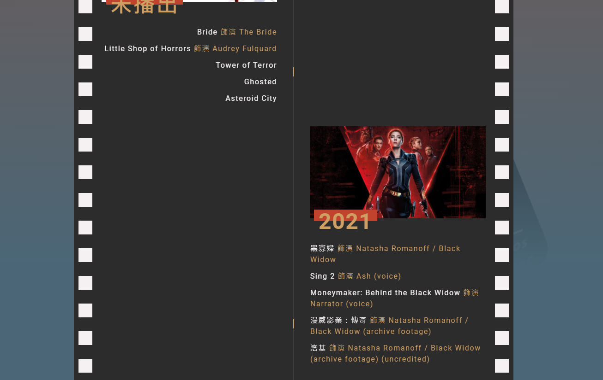
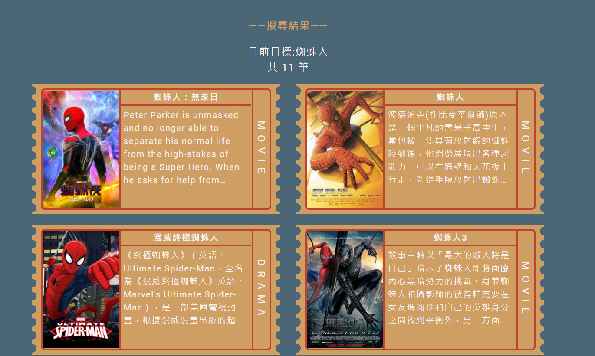

# movie-drama


## Demo

[Demo](https://g6165310.github.io/moviedrama/#/)

## 介紹
Vue 2 更新至 Vue 3 有蠻大的改動，由於想試看看使用 Vue 3 開發，也藉此練習的過程中了解 Vue 3 的改動。
此次練習開發一個串接影視相關的 API ，呈現熱門影視作品，作品、演員查詢、以及每日隨機推薦一作品等功能
### Vue 3
> Vue 2 重寫為 Vue 3 根據作者的說法主要是為了 JavaScript 新語法的支援以及整體設計架構上暴露的問題  

底下提一下我覺得很重要的兩件事
- Composition API   
    由於 Option API 撰寫的過程容易將邏輯分散在 data、methods、computed 等區塊，在大型專案或功能複雜的情況下，會有閱讀或維護上的困難。  
    而 Compostion API 則只需要將功能邏輯撰寫在同一個 setup() 中即可，在 setup() 中再根據功能可以自由地區分出來。  
    另外當有一些可複用的 function，可以更簡單地分離出來，然後在所需的組件中使用，減少重複的程式碼。  
    ```javascript
    import useData from '../methods/getData'

    export default {
        setup(){
            const { results, totalPages, getNowing } = useData()
        }
    }

- 雙向綁定  
    Vue 2 的雙向綁定是透過 ```defineProperty```  
    > ```defineProperty``` 的機制  
    Vue 在初始化的過程，會遍歷 data 物件所有屬性，透過 ```defineProperty``` 將屬性轉為 ```getter /setter```，由於這個雙向綁定的過程會 Vue 初始化的時候執行，以至於後來想新增 data 的屬性是不允許的，且無法直接間踢陣列，所以 Vue 得另外針對陣列方法進行處理

    Vue 3 的為了改善一些效能上的問題以及無法監聽陣列變化的問題，使用 ES6 的 ```Proxy``` 改寫  
    > ```proxy ``` 的機制  
    proxy 用於對物件進行一些自定義的操作行為，對於外部的訪問都必須先經過這層 proxy 設下的攔截行為  
    相比 ``` defineProperty ```，``` proxy ``` 直接代理整個目標，而``` defineProperty```則只是挾持目標的屬性  
    
    > 查看了一下官方簡易版實作的教學，會發現其實觸發的機制是一樣的，主要差在 "綁架" ```getter/setter``` 使用的方式不同，且 Proxy 版本多使用一個 Map 紀錄各 property 的依賴 ```dep()```，這使 Proxy 可以隨意新增 property 不受限制
    [defineProperty](https://codepen.io/GreggPollack/pen/xjoEOo?editors=1010) V.S [Proxy](https://codepen.io/GreggPollack/pen/gKogaE)

    
    ```javascript
    const target = 
    {
        name:'Gary'
        
    }
    /*target 需要攔截的對象 可以是任何類別*/
    const proxy = new Proxy(target, {
        set:() /*設定*/
         /*讀取*/
        get(target,key){
            if(key==='name'){
                console.log('my name is '+ Reflect.get(target,key))
            }
        }
        ...../*還有其他可用的屬性*/
    })
    proxy.name // my name is Gary

## API說明
本次專案選擇 TMDB 的 API 來進行開發，相比 IMDB 相關的 API 來說，TMDB 有提供中文資料以及免費、無限制的請求數，比較符合本次開發的需求。

### 基本設定
- 基本請求網址為 ``` https://api.themoviedb.org/3/[相關接口]?api_key=<<api_key>>&[相關參數設定]```
- 網站以中文為主，故參數 ```region``` 設定為 ```TW ```
- 參數 ``` language ``` 設為 ```zh-TW``` 或 ```en-US``` 以防無中文字的問題
- 參數 ```append_to_response``` 在取得細節資料的時候使用該參數可以針對不同資料同時進行請求 (ex:影片或圖像等等)
### 相關接口
* ```/movie(tv)/latest``` 取得最新新增的一筆電影或影視作品的資料
* ```/movie/now_playing``` 取得近期上映電影
* ```/search/multi``` 支援同時查詢電影、影視作品、人名
* ```/movie(tv)/popular``` 取得當前熱門電影、影視作品
* ```/movie(tv、person)/{id}``` 取得電影、影視作品、人物的詳細資料
* ```/collection/{collection_id}``` 取得系列作品資料
* ```/tv/{id}/season/{season_number}``` 取得影集作品各季各集數的資料

## 設計
- 配色相關  
    由於自己相對喜歡復古風格，所以選擇配色網站中一款風格為 **Rusted Modern Color Palette**，主要配色為繡紅色```#c1432e```、繡金色```#ce9e62``` 以及靛青色``` #4b6777```
- 元素設計  
    由於網站是影視作品，所以在一些需要拉動瀏覽的部分使用**電影膠片**作為背景營造隨著瀏覽膠片跟著播放不同內容的感受。

    
    
    另外，於搜尋結果的選擇電影票的方式去呈現，經由電影票在進入該電影或影集的詳細頁面，讓人有一種選擇了一部電影、影集去觀看的感受。

    

### 
1. 每日推薦  


## 開發重點

### CSS
* 使用 scss 進行開發，並盡可能嘗試使用 BEM 的設計方式，且將檔案依功能進行抽離
    >BEM 主要的是根據 ```block``` 、```element```、```modiifer```針對不同的元素進行 class 命名，使命名更語義化、更容易維護
    ```javascript
    範例:
    <div class="card card--active">
        <div class="card__title"></div>
        <div class="card__content"></div>
    </div>
* 網站中常出現的幻燈片背景，主要利用```background``` 中的 ```linear-gradient```去堆疊三層背景製作，由於以前比較少做多層的背景，這次特別去了解一下```background``` 和 ```linear-gradient``` 的使用方式
    ```css 
    background:
        第一層背景, /**顯示於最上層**/
        第二層背景,
        第三層背景  /**顯示於最下層**/
    ```
    > linear-gradient(漸層方向,顏色斷點,顏色斷點)  
    由於這次對於黑白兩個顏色之間不需要漸變色，所以上一個顏色結束點與下一個顏色的起始點需要重疊
    ```css
    background:
      linear-gradient(180deg, #000 25%,#fff 25%,#fff 75%,#000 75%,#000 100%)
### JS
* Fetch Data  
  由於 Composition API 的關係，可以更方便的去進行邏輯的分離以及模組化，本次專案中最常執行就是取得遠端資料，所以將取得資料的方法抽離出各組件、頁面，方便使用且減少程式碼的重複撰寫。
  ```javascript
  /*getData.js*/
  export default function(){
      const fetchData = async(path,params)=>{
          const option = {...}
          const response = await fetch(url,option) 
          const data = await response.json()
          return data
      }
      const getPopular = async()=>{
          const { data } = await fetchData(url)
          /*其他對資料的處理*/
          return data
      }
      return {getPopular,....}/*將取得各式資料的方法傳出*/
  }
  /*Home.vue*/
  import useData from 'getData.js'
  export default{
    setup(){
        const data = ref([])
        const { getPopular,.... } = useData()/*在頁面中取出要使用的方法*/
        onMounted(async()=>{
            data.value = await getPopular()
        })
    }
  }
* API 私鑰問題  
  由於請求是由前端送出，私鑰會有暴露的問題，所以使用 express 建立代理請求 ，將私鑰放置於 express ，並上傳於 heroku 上啟用。
  ```javascript
  /*私鑰放置於 express 中的 .env，並於 express 中使用*/
  app.post('/getData'.(req,res)=>{
      /*取得API KEY 並重組 URL*/
      const url = `${process.env.BASE_PATH}${req.body.path}?api_key=${process.env.API_KEY}`

      /*真正向 TMDB API 取得資料,而 vue 端送出的請求實際上是對 express 請求*/
      fetch(url).then(...)
  })

* 全域變數  
  將一些跨元件會使用到的狀態統一使用 ```store.js``` 來管理，原本是使用 ```provide/inject``` 的方式來傳遞變數，但 ```provide/inject``` 只能使用於 ```setup()``` 中，所以為了更方便地、更簡潔地使用，後改為使用類似 vuex 的方式去管理狀態。
  > provide / inject : 可以讓父層往所有子層 ( 包含子層的子層 ) 傳遞參數，不管都深的子層都能使用 inject 得到 (祖)父層的變數
  ```javascript
  /*store.js*/
  import { ref, computed } from 'vue'
  const isLoading = ref(false)
  export default function useStore () {
    /*變更狀態的行為都要透過這個 funtion */
    const toggleIsLoading = () => {
        isLoading.value = !isLoading.value
    }
    return {
        isLoading: computed(() => isLoading.value),/*透過 computed 使狀態從外部只能讀取不能直接修改*/
        toggleIsLoading,
    }
  }
  /*Home.vue*/
  import useStore from 'store.js'
  const { isLoading, toggleIsLoading } = useStore() /*取得狀態與變更狀態的方法*/

* 推薦功能  
  > 每日隨機推薦一部分電影或是影集，於同一日中開啟網站會得到一樣的結果

  TMDB API 沒有提供隨機取得一部作品的方法，所以只能使用組合技。
  1. 隨機選擇種類 ```movie``` 或是 ```tv```
  2. 利用 ```/movie(tv)/latest``` 這個接口可以得到最新一次更新的作品 id
  3. 再從 0 ~ id 數字中隨機取得一個數字
  4. 將隨機得到的數字再透過 API 去取得詳細資料
  5. 如果是無效 id ( 取得資料失敗 ) 或是成人內容的話，會重複執行步驟 3 、4 ，直到成功
  6. 並將結果儲存於 localStorage，方便下次回到網站直接取用
  ```javascript
  const getDaily=async()=>{
      /*先詢問 localStorage 是否有資料*/
      if(!localStorage.getItem('date') ||localStorage.getItem('date') !== date){
          const id = await fetchData(`${type}/latest`)
          while(1){
              const random = Math.floor(Math.random() * (id+ 1))
               /*這裡多傳一個控制變數 isDaily ，主要是為了告訴 faetchData，這是來自 getDaily 的請求，避免無效 id 請求失敗後直接跳轉到失敗頁面*/
              await getDetails(type, random, isDaily)
                         .
                         .
                         .
              break
          }
          localStorage.setItem('daily', JSON.stringify(results))
                         .
                         .
                         .
      }else{
          /*如果 localStorage 有資料就直接取資料*/
          results = JSON.parse(localStorage.getItem('daily'))
      }
  }
  
* Intersection Observer API  
  由於 API 回傳的結果，都是經過分頁的，每次都只能拿回 20 筆，剛好可以利用此特性做 Infinite Scroll，原本是利用 ```eventListener``` 去監聽 ```scroll```動作，後來發現原生的 Intersection Observer API 好像是一個更好的選擇。
  > Intersection Observer API :  
    能夠自動偵測 ( 非同步 ) 目標元素是否進入 (離開) 指定的外層或預設的 viewport  
    與傳統的 ```addEventListener('scroll',callback)``` 差別是，listener 會每次滾動時就觸發執行 callback 查看是否要載入新資料，加上還要計算目標元素的位置、卷軸的位置等等，較為繁雜的計算過程，相較 Intersection Observer 直接針對目標是否已經進入目標範圍去執行動作更為不方便
  ```javascript
  /*為了方便在不同頁面都可以使用，故將 observer 的行為寫成一個元件 */
  <template>
    /* vue 3 中取得 dom 元素的方法需使用 ref 於標籤中*/
    <div
      ref="detectArea"
      class="detectArea"
    />
  </template>
  <script>
    export default {
    name: 'InfiniteScrollObserver',
    emits: {
        'callback-function': null
    },
    setup (props, { emit }) {
        /* 由於 vue 3 setup() 中無法使用 this，所以使用跟一般資料雙向綁定的方式一樣，return 此變數與畫面上的 dom 元素進行掛勾*/
        const detectArea = ref(null)
        const options = {
            root: null, /*預設或未指定 以 viewport 作為觀察的範圍，必須是目標元素的父層*/
            rootMargin: '0px', /*設定 root 的 margin 擴大或縮小 可觀察的範圍*/
            threshold: 1 
            /* 所觀察的目標進入觀察範圍中的可見度 可設定 0~1
               0:代表目標只要進入或完全離開就觸發
               1:代表目標完全進入或一離開
            */
        }
        const observer = new IntersectionObserver(([entry]) => {
            if (entry && entry.isIntersecting) {
                /*當觸發時執行任務，由於個頁面要請求的資料不同，所以這裡使用 emit 的方式，去執行父層頁面實際要做的事情*/
                emit('callback-function')
            }}, options)
        onMounted(() => {
            /*綁定要觀察的目標物*/
            observer.observe(detectArea.value) 
        })
        onUnmounted(() => {
            /*停止觀察*/
            observer.disconnect() 
        })
        return {
        detectArea
        }
    }
    }
    </script>


    /*以Home.vue 為例*/
    
    <template>
        <div>
            <ul>
                <li v-for=(..)in data></li>
            </ul>
        </div>
        /*在需要觸發infinite scroll 位置放置上述做好的 Observer 元件 */
        <InfiniteScrollObserver @callback-function="handler"/>
    </template>

    <script>
        setup(){
            /*當觀察元件發現目標進入範圍並觸發 callback 發送 emit 後，實際上是到這裡執行 handler() */
            const handler = async()=>{
                await getData(...)
            }
        }
    </script> 
## 預期新增功能
* 同性質作品推薦，利用接口 ```/discover/movie(tv)/``` 以及參數 ``` with_genres``` 可以找到符合特定 genres 的作品
* 全球票房排名，可利用接口 ```/discover/movie/``` 以及參數 ```sort_by=revenue.desc```

## 優化項目
1. 每日推薦目前是單純隨機，考慮新增一些篩選條件 如 ```評分、票房``` 等
## 參考資料
- [API 文件](https://developers.themoviedb.org/3/movies/get-latest-movie)
- [功能版型發想](https://www.themoviedb.org/?language=zh-TW)
- [配色選擇](https://hookagency.com/blog/website-color-schemes-2020/)
- [Vue 官網](https://v3.cn.vuejs.org/guide/reactivity.html)
- [BEM設計模式](https://chupainotebook.blogspot.com/2019/05/bemcss.html)
